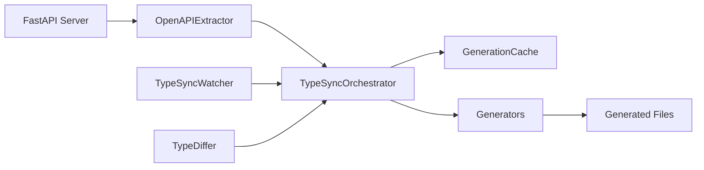

# Type-Sync Package Documentation & Enhancement Roadmap

**Document Version:** 1.0  
**Last Updated:** June 16, 2025  
**Package:** `@farm-framework/type-sync v0.0.1`

---

## 📋 Table of Contents

1. [Current State Overview](#current-state-overview)
2. [Core Architecture](#core-architecture)
3. [Feature Analysis](#feature-analysis)
4. [Enhancement Opportunities](#enhancement-opportunities)
5. [Technical Improvements](#technical-improvements)
6. [New Feature Proposals](#new-feature-proposals)
7. [Performance Optimizations](#performance-optimizations)
8. [Developer Experience Enhancements](#developer-experience-enhancements)
9. [Integration Improvements](#integration-improvements)
10. [Future Roadmap](#future-roadmap)

---

## 🎯 Current State Overview

### Package Purpose

The `@farm-framework/type-sync` package provides automated TypeScript type generation and API client code for FARM applications. It extracts OpenAPI schemas from FastAPI backends and generates strongly typed artifacts to maintain frontend-backend synchronization.

### Current Version Status

- **Version:** 0.0.1 (Early development)
- **Stability:** Functional but needs enhancement
- **Test Coverage:** Basic e2e tests only
- **Documentation:** README exists but needs expansion

### Key Dependencies

```json
{
  "production": [
    "@farm-framework/types",
    "change-case",
    "fs-extra",
    "lodash-es",
    "openapi-types"
  ],
  "development": ["chokidar", "typescript", "tsup"]
}
```

---

## 🏗️ Core Architecture

### Component Overview

```
TypeSync Architecture
├── 🔄 TypeSyncOrchestrator (coordinator)
├── 🌐 OpenAPIExtractor (schema extraction)
├── 💾 GenerationCache (caching layer)
├── 👁️ TypeSyncWatcher (file watching)
├── 🔍 TypeDiffer (change detection)
└── 🔧 Generators/
    ├── TypeScriptGenerator
    ├── APIClientGenerator
    ├── ReactHookGenerator
    └── AIHookGenerator
```

### Data Flow



### Current Generators

1. **TypeScriptGenerator**

   - Generates raw TypeScript interfaces
   - Maps OpenAPI schemas to TS types
   - Handles enums, unions, and complex types

2. **APIClientGenerator**

   - Creates Axios-based HTTP client
   - Includes authentication support
   - Optional streaming capabilities

3. **ReactHookGenerator**

   - Generates React Query hooks
   - Supports mutations and queries
   - Optional infinite queries

4. **AIHookGenerator**
   - Specialized hooks for AI endpoints
   - Currently minimal implementation

---

## 📊 Feature Analysis

### ✅ Implemented Features

| Feature                    | Status      | Quality | Notes                            |
| -------------------------- | ----------- | ------- | -------------------------------- |
| OpenAPI Schema Extraction  | ✅ Complete | Good    | Supports server startup, retries |
| TypeScript Type Generation | ✅ Complete | Good    | Basic type mapping works         |
| API Client Generation      | ✅ Complete | Fair    | Axios-based, needs refinement    |
| React Query Hooks          | ✅ Complete | Fair    | Basic implementation             |
| Caching System             | ✅ Complete | Good    | Hash-based with compression      |
| File Watching              | ✅ Complete | Fair    | Basic chokidar integration       |
| Performance Metrics        | ✅ Complete | Good    | Timing and file counts           |

### ⚠️ Partial Implementations

| Feature            | Status     | Issues                        | Priority |
| ------------------ | ---------- | ----------------------------- | -------- |
| Error Handling     | ⚠️ Partial | Needs more graceful fallbacks | High     |
| Documentation      | ⚠️ Partial | Missing API docs and examples | Medium   |
| AI Hook Generation | ⚠️ Partial | Very basic implementation     | Low      |
| Test Coverage      | ⚠️ Partial | Only e2e tests exist          | High     |

### ❌ Missing Features

| Feature                 | Impact | Complexity | Priority |
| ----------------------- | ------ | ---------- | -------- |
| Schema Validation       | High   | Medium     | High     |
| Custom Template Support | Medium | High       | Medium   |
| Multi-file Generation   | Medium | Medium     | Medium   |
| Plugin Architecture     | High   | High       | Low      |

---

## 🚀 Enhancement Opportunities

### 1. Code Quality Improvements

#### A. Enhanced Error Handling

```typescript
// Current: Basic try/catch
try {
  const schema = await this.extractor.extract();
} catch (error) {
  console.error("Extraction failed:", error);
}

// Enhanced: Structured error handling with recovery
try {
  const schema = await this.extractor.extractWithRetry({
    maxRetries: 3,
    backoffStrategy: "exponential",
    fallbackToCache: true,
  });
} catch (error) {
  if (error instanceof SchemaExtractionError) {
    return this.handleSchemaError(error);
  }
  throw new TypeSyncError("Critical extraction failure", { cause: error });
}
```

#### B. Improved Type Safety

```typescript
// Current: Loose typing
async generate(schema: any, opts: any): Promise<any>

// Enhanced: Strict typing with generics
async generate<T extends GeneratorOptions>(
  schema: ValidatedOpenAPISchema,
  opts: T
): Promise<GenerationResult<T>>
```

#### C. Better Configuration Management

```typescript
interface TypeSyncConfig {
  extraction: ExtractionConfig;
  generation: GenerationConfig;
  caching: CacheConfig;
  watching: WatchConfig;
  output: OutputConfig;
}

class TypeSyncConfigManager {
  static validate(config: Partial<TypeSyncConfig>): ValidationResult;
  static merge(
    base: TypeSyncConfig,
    overrides: Partial<TypeSyncConfig>
  ): TypeSyncConfig;
  static fromFile(path: string): Promise<TypeSyncConfig>;
}
```

### 2. Performance Enhancements

#### A. Parallel Generation

```typescript
// Current: Sequential generation
for (const generator of this.generators) {
  await generator.generate(schema, opts);
}

// Enhanced: Parallel execution with dependency management
const generationPlan = this.createGenerationPlan(schema);
await this.executeGenerationPlan(generationPlan, {
  maxConcurrency: 4,
  dependencyResolution: true,
});
```

#### B. Incremental Updates

```typescript
interface IncrementalUpdateManager {
  detectChanges(oldSchema: OpenAPISchema, newSchema: OpenAPISchema): ChangeSet;
  generateAffectedFiles(changes: ChangeSet): string[];
  updateIncrementally(changes: ChangeSet): Promise<UpdateResult>;
}
```

#### C. Smart Caching

```typescript
class SmartCache extends GenerationCache {
  // Cache individual components, not just full generations
  async getCachedComponent(componentId: string): Promise<CachedComponent>;

  // Dependency-aware invalidation
  async invalidateAffectedComponents(changes: ChangeSet): Promise<void>;

  // Compression and serialization improvements
  async compressLargeArtifacts(threshold: number): Promise<void>;
}
```

---

## 🔧 Technical Improvements

### 1. Schema Validation & Processing

#### A. OpenAPI Schema Validator

```typescript
class OpenAPISchemaValidator {
  static async validate(schema: unknown): Promise<ValidationResult> {
    // JSON Schema validation
    // OpenAPI spec compliance
    // Custom business rules
  }

  static sanitize(schema: OpenAPISchema): SanitizedSchema {
    // Remove unsafe properties
    // Normalize naming conventions
    // Apply transformation rules
  }
}
```

#### B. Advanced Type Mapping

```typescript
interface TypeMappingStrategy {
  mapPrimitiveType(schema: OpenAPIType): string;
  mapComplexType(schema: OpenAPIType): string;
  mapArrayType(schema: OpenAPIType): string;
  mapUnionType(schemas: OpenAPIType[]): string;
  mapGenericType(schema: OpenAPIType, context: GenerationContext): string;
}

class AdvancedTypeMapper implements TypeMappingStrategy {
  // Handle nullable types better
  // Support for branded types
  // Recursive type detection and handling
  // Custom type annotations
}
```

### 2. Generator Architecture Improvements

#### A. Plugin-Based Generator System

```typescript
interface GeneratorPlugin {
  name: string;
  version: string;
  dependencies?: string[];

  generate(context: GenerationContext): Promise<GenerationResult>;
  validate(options: any): ValidationResult;
  getSchema(): JSONSchema;
}

class PluginManager {
  async loadPlugin(pluginPath: string): Promise<GeneratorPlugin>;
  async executePlugins(context: GenerationContext): Promise<GenerationResult[]>;
  validatePluginCompatibility(plugins: GeneratorPlugin[]): ValidationResult;
}
```

#### B. Template-Based Generation

```typescript
interface TemplateEngine {
  registerTemplate(name: string, template: Template): void;
  renderTemplate(name: string, context: TemplateContext): Promise<string>;
  compileTemplate(source: string): Template;
}

class HandlebarsTemplateEngine implements TemplateEngine {
  // Custom helpers for TypeScript generation
  // Partial template support
  // Template inheritance
  // Syntax highlighting for generated code
}
```

### 3. Advanced File Management

#### A. Multi-File Generation Strategy

```typescript
interface FileGenerationStrategy {
  determineFileStructure(schema: OpenAPISchema): FileStructure;
  generateFileContents(structure: FileStructure): Promise<GeneratedFile[]>;
  optimizeImports(files: GeneratedFile[]): GeneratedFile[];
}

// Example strategies:
// - Single file (current)
// - Per-resource files
// - Feature-based organization
// - Domain-driven organization
```

#### B. Code Formatting & Optimization

```typescript
class CodeFormatter {
  async formatTypeScript(
    code: string,
    options: PrettierOptions
  ): Promise<string>;
  async optimizeImports(code: string): Promise<string>;
  async addLinting(code: string): Promise<string>;
  async generateSourceMaps(
    code: string,
    context: GenerationContext
  ): Promise<SourceMap>;
}
```

---

## 🆕 New Feature Proposals

### 1. Advanced Type System Features

#### A. Branded Types Support

```typescript
// Generate branded types for better type safety
type UserId = string & { readonly __brand: "UserId" };
type Email = string & { readonly __brand: "Email" };

// In generated client:
interface UserAPI {
  getUser(id: UserId): Promise<User>;
  updateEmail(id: UserId, email: Email): Promise<void>;
}
```

#### B. Runtime Type Validation

```typescript
// Generate runtime validators alongside types
import { z } from "zod";

export const UserSchema = z.object({
  id: z.string().brand<"UserId">(),
  email: z.string().email().brand<"Email">(),
  createdAt: z.date(),
});

export type User = z.infer<typeof UserSchema>;
```

#### C. Type Guards Generation

```typescript
// Auto-generated type guards
export function isUser(value: unknown): value is User {
  return UserSchema.safeParse(value).success;
}

export function assertUser(value: unknown): asserts value is User {
  if (!isUser(value)) {
    throw new TypeError("Expected User object");
  }
}
```

### 2. Enhanced API Client Features

#### A. Advanced HTTP Client

```typescript
class AdvancedAPIClient extends APIClient {
  // Request/response middleware
  use(middleware: RequestMiddleware | ResponseMiddleware): void;

  // Automatic retries with exponential backoff
  withRetries(config: RetryConfig): this;

  // Request deduplication
  withDeduplication(config: DeduplicationConfig): this;

  // Offline support
  withOfflineSupport(config: OfflineConfig): this;

  // Real-time subscriptions
  subscribe<T>(endpoint: string, callback: (data: T) => void): Subscription;
}
```

#### B. GraphQL-Style Field Selection

```typescript
// Generate field selection for REST APIs
interface UserFieldSelector {
  id?: boolean;
  email?: boolean;
  profile?: {
    name?: boolean;
    avatar?: boolean;
  };
}

const user = await client.users.get(userId, {
  select: { id: true, profile: { name: true } },
});
// Type: { id: string; profile: { name: string } }
```

#### C. Streaming & Real-time Support

```typescript
class StreamingAPIClient extends APIClient {
  // Server-sent events
  streamEvents<T>(endpoint: string): AsyncIterable<T>;

  // WebSocket connections
  connectWebSocket<T>(endpoint: string): WebSocketConnection<T>;

  // File uploads with progress
  uploadFile(file: File, onProgress: ProgressCallback): Promise<UploadResult>;
}
```

### 3. Enhanced React Integration

#### A. Advanced Hook Patterns

```typescript
// Optimistic updates with rollback
const useOptimisticUserUpdate = (userId: string) => {
  return useMutation({
    mutationFn: updateUser,
    onMutate: async (newData) => {
      await queryClient.cancelQueries(["user", userId]);
      const previousUser = queryClient.getQueryData(["user", userId]);
      queryClient.setQueryData(["user", userId], newData);
      return { previousUser };
    },
    onError: (err, newData, context) => {
      queryClient.setQueryData(["user", userId], context?.previousUser);
    },
  });
};

// Infinite queries with virtualization
const useVirtualizedUserList = (filters: UserFilters) => {
  return useInfiniteQuery({
    queryKey: ["users", filters],
    queryFn: ({ pageParam }) =>
      client.users.list({ ...filters, offset: pageParam }),
    getNextPageParam: (lastPage) => lastPage.nextOffset,
    // Integration with react-window/react-virtualized
  });
};
```

#### B. Form Integration

```typescript
// Auto-generated form schemas
const UserFormSchema = generateFormSchema(UserCreateSchema);

const useUserForm = () => {
  return useForm<UserCreate>({
    schema: UserFormSchema,
    onSubmit: async (data) => {
      await client.users.create(data);
    },
  });
};
```

#### C. State Management Integration

```typescript
// Redux Toolkit Query integration
const api = createApi({
  reducerPath: "generatedApi",
  baseQuery: fetchBaseQuery({
    baseUrl: client.baseURL,
  }),
  endpoints: (builder) => ({
    // Auto-generated endpoints from OpenAPI
    ...generateRTKEndpoints(schema),
  }),
});

// Zustand integration
const useGeneratedStore = create<GeneratedState>((set) => ({
  // Auto-generated store methods
  ...generateZustandActions(schema, set),
}));
```

---

## ⚡ Performance Optimizations

### 1. Generation Performance

#### A. Incremental Compilation

```typescript
class IncrementalCompiler {
  private dependencyGraph = new Map<string, Set<string>>();
  private fileHashes = new Map<string, string>();

  async compileAffectedFiles(
    changedFiles: string[]
  ): Promise<CompilationResult> {
    const affectedFiles = this.getAffectedFiles(changedFiles);
    return this.compileFiles(affectedFiles);
  }

  private getAffectedFiles(changedFiles: string[]): string[] {
    // Traverse dependency graph to find all affected files
  }
}
```

#### B. Parallel Processing

```typescript
class ParallelGenerator {
  private workers = new Set<Worker>();

  async generateInParallel(
    tasks: GenerationTask[]
  ): Promise<GenerationResult[]> {
    const chunks = this.chunkTasks(tasks, this.workers.size);
    const promises = chunks.map((chunk) => this.processChunk(chunk));
    return Promise.all(promises).then((results) => results.flat());
  }
}
```

#### C. Memory Optimization

```typescript
class MemoryOptimizedCache {
  private lruCache = new LRU<string, CacheEntry>({ max: 1000 });
  private compressionLevel = 9;

  async store(key: string, data: any): Promise<void> {
    const compressed = await this.compress(data);
    this.lruCache.set(key, { data: compressed, timestamp: Date.now() });
  }

  async retrieve(key: string): Promise<any> {
    const entry = this.lruCache.get(key);
    return entry ? this.decompress(entry.data) : null;
  }
}
```

### 2. Runtime Performance

#### A. Tree Shaking Support

```typescript
// Generate ESM modules with proper tree shaking
export { UserAPI } from './users';
export { PostAPI } from './posts';
export type { User, Post } from './types';

// Conditional exports for different environments
{
  "exports": {
    ".": {
      "import": "./dist/esm/index.js",
      "require": "./dist/cjs/index.js"
    },
    "./client": {
      "import": "./dist/esm/client.js",
      "require": "./dist/cjs/client.js"
    },
    "./types": {
      "import": "./dist/esm/types.js",
      "require": "./dist/cjs/types.js"
    }
  }
}
```

#### B. Bundle Size Optimization

```typescript
class BundleOptimizer {
  async analyzeBundleSize(
    generatedFiles: GeneratedFile[]
  ): Promise<BundleAnalysis> {
    // Analyze generated code size
    // Suggest optimizations
    // Generate size reports
  }

  async optimizeForSize(options: OptimizationOptions): Promise<OptimizedFiles> {
    // Remove unused exports
    // Minimize generated code
    // Apply compression techniques
  }
}
```

---

## 🛠️ Developer Experience Enhancements

### 1. Enhanced CLI Tools

#### A. Interactive CLI

```bash
# Enhanced CLI with interactive mode
npx @farm-framework/type-sync init
? What type of API are you connecting to? (FastAPI)
? Where is your API running? (http://localhost:8000)
? Where should we generate files? (./src/generated)
? Enable React hooks? (Yes)
? Enable AI features? (No)

# Watch mode with better feedback
npx @farm-framework/type-sync watch --verbose
✓ Connected to API at http://localhost:8000
✓ Schema extracted (142 endpoints)
✓ Generated TypeScript types (12ms)
✓ Generated API client (8ms)
✓ Generated React hooks (15ms)
📁 Files written to ./src/generated/
👀 Watching for changes...
```

#### B. Configuration Wizard

```typescript
class ConfigurationWizard {
  async runInteractiveSetup(): Promise<TypeSyncConfig> {
    const answers = await this.promptUser([
      {
        type: "input",
        name: "apiUrl",
        message: "What is your API URL?",
        default: "http://localhost:8000",
      },
      {
        type: "multiselect",
        name: "generators",
        message: "Which generators would you like to enable?",
        choices: ["types", "client", "hooks", "forms", "tests"],
      },
    ]);

    return this.buildConfig(answers);
  }
}
```

### 2. Better Error Messages & Debugging

#### A. Structured Error Reporting

```typescript
class DetailedErrorReporter {
  reportSchemaError(error: SchemaError): void {
    console.error(`
❌ Schema Extraction Failed

Problem: ${error.message}
Location: ${error.endpoint}
Suggestion: ${this.getSuggestion(error)}

Debug Information:
- API URL: ${error.context.apiUrl}
- Status Code: ${error.context.statusCode}
- Response: ${error.context.response}

To fix this:
1. Ensure your API is running
2. Check the OpenAPI endpoint is accessible
3. Verify the schema is valid
`);
  }
}
```

#### B. Schema Diff Visualization

```typescript
class SchemaDiffVisualizer {
  generateDiffReport(
    oldSchema: OpenAPISchema,
    newSchema: OpenAPISchema
  ): DiffReport {
    return {
      added: this.findAddedEndpoints(oldSchema, newSchema),
      removed: this.findRemovedEndpoints(oldSchema, newSchema),
      modified: this.findModifiedEndpoints(oldSchema, newSchema),
      breaking: this.findBreakingChanges(oldSchema, newSchema),
    };
  }

  renderDiff(diff: DiffReport): string {
    // Generate colored console output or HTML report
  }
}
```

### 3. IDE Integration

#### A. VS Code Extension

```typescript
// Extension features:
// - Schema preview
// - Type navigation
// - Auto-completion for generated types
// - Real-time schema validation
// - Generation status in status bar
```

#### B. TypeScript Language Service Plugin

```typescript
class TypeSyncLanguageServicePlugin {
  // Provide hover information for generated types
  // Add quick fixes for API updates
  // Show inline documentation from OpenAPI
  // Navigate to API endpoint definitions
}
```

---

## 🔄 Integration Improvements

### 1. Build Tool Integration

#### A. Vite Plugin

```typescript
export function farmTypeSyncPlugin(options: TypeSyncPluginOptions): Plugin {
  return {
    name: "farm-type-sync",
    buildStart() {
      // Generate types before build
    },
    handleHotUpdate(ctx) {
      // Regenerate on API changes
    },
  };
}
```

#### B. Webpack Plugin

```typescript
class FarmTypeSyncWebpackPlugin {
  apply(compiler: Compiler) {
    compiler.hooks.beforeCompile.tapAsync(
      "FarmTypeSync",
      async (params, callback) => {
        await this.generateTypes();
        callback();
      }
    );
  }
}
```

#### C. Next.js Integration

```typescript
// next.config.js
const withFarmTypeSync = require("@farm-framework/type-sync/next");

module.exports = withFarmTypeSync({
  typeSync: {
    apiUrl: process.env.API_URL,
    outputDir: "./src/generated",
  },
});
```

### 2. Testing Integration

#### A. Test Generation

```typescript
class TestGenerator implements Generator {
  async generate(
    schema: OpenAPISchema,
    opts: TestGeneratorOptions
  ): Promise<GenerationResult> {
    // Generate Jest/Vitest tests for API endpoints
    // Generate MSW mocks
    // Generate contract tests
    // Generate performance tests
  }
}
```

#### B. Mock Generation

```typescript
class MockDataGenerator {
  generateMockData(schema: OpenAPIType): any {
    // Generate realistic mock data
    // Support for faker.js integration
    // Consistent data across test runs
  }

  generateMSWHandlers(schema: OpenAPISchema): MSWHandler[] {
    // Generate MSW handlers for all endpoints
    // Include realistic response data
    // Support for different scenarios
  }
}
```

### 3. CI/CD Integration

#### A. GitHub Actions Integration

```yaml
name: Type Sync Check
on: [push, pull_request]

jobs:
  type-sync:
    runs-on: ubuntu-latest
    steps:
      - uses: actions/checkout@v3
      - uses: farm-framework/type-sync-action@v1
        with:
          api-url: ${{ secrets.API_URL }}
          verify-only: true # Don't commit changes
```

#### B. Schema Version Management

```typescript
class SchemaVersionManager {
  async compareWithPrevious(
    newSchema: OpenAPISchema
  ): Promise<ComparisonResult> {
    // Compare with previous version
    // Detect breaking changes
    // Generate migration guides
  }

  async publishSchema(schema: OpenAPISchema, version: string): Promise<void> {
    // Publish to schema registry
    // Tag with version
    // Notify consumers
  }
}
```

---

## 🗺️ Future Roadmap

### Phase 1: Foundation Improvements (Q3 2025)

**Priority: High**

- [ ] Comprehensive test coverage (unit, integration, e2e)
- [ ] Enhanced error handling and recovery
- [ ] Configuration validation and management
- [ ] Performance optimizations (parallel processing)
- [ ] Documentation improvements

**Estimated Timeline:** 6-8 weeks

### Phase 2: Advanced Features (Q4 2025)

**Priority: Medium**

- [ ] Plugin architecture implementation
- [ ] Template-based generation system
- [ ] Multi-file generation strategies
- [ ] Schema validation and sanitization
- [ ] Advanced type mapping (branded types, runtime validation)

**Estimated Timeline:** 8-10 weeks

### Phase 3: Developer Experience (Q1 2026)

**Priority: Medium**

- [ ] Interactive CLI and configuration wizard
- [ ] VS Code extension
- [ ] Enhanced debugging and diff visualization
- [ ] Build tool integrations (Vite, Webpack, Next.js)
- [ ] CI/CD tooling

**Estimated Timeline:** 6-8 weeks

### Phase 4: Advanced Integrations (Q2 2026)

**Priority: Low-Medium**

- [ ] GraphQL-style field selection
- [ ] Streaming and real-time support
- [ ] Advanced React patterns (optimistic updates, virtualization)
- [ ] State management integrations (Redux, Zustand)
- [ ] Test and mock generation

**Estimated Timeline:** 10-12 weeks

### Phase 5: Enterprise Features (Q3 2026)

**Priority: Low**

- [ ] Schema registry integration
- [ ] Multi-API support and orchestration
- [ ] Advanced caching strategies
- [ ] Monitoring and analytics
- [ ] Migration tools and versioning

**Estimated Timeline:** 8-10 weeks

---

## 📈 Success Metrics

### Technical Metrics

- **Generation Speed:** < 5 seconds for schemas with 100+ endpoints
- **Cache Hit Rate:** > 90% in development mode
- **Bundle Size Impact:** < 50kb for typical generated client
- **Type Safety:** 100% type coverage for generated code

### Developer Experience Metrics

- **Setup Time:** < 5 minutes from zero to working integration
- **Error Resolution Time:** < 10 minutes for common issues
- **Documentation Coverage:** 100% API surface documented
- **Community Adoption:** 50+ GitHub stars, 10+ contributors

### Quality Metrics

- **Test Coverage:** > 95% line coverage
- **Bug Rate:** < 1 critical bug per month
- **Performance Regression:** 0 tolerance
- **Breaking Changes:** Deprecation warnings 3 months before removal

---

## 🤝 Contributing Guidelines

### Getting Started

1. Read the current codebase and understand the architecture
2. Set up development environment with provided scripts
3. Run existing tests and ensure they pass
4. Pick an issue from the roadmap or create a new proposal

### Development Workflow

1. Create feature branch from `main`
2. Implement changes with comprehensive tests
3. Update documentation as needed
4. Ensure all CI checks pass
5. Request review from maintainers

### Code Standards

- TypeScript strict mode enabled
- 100% type coverage for new code
- Comprehensive error handling
- Performance-conscious implementations
- Clear, self-documenting code

---

## 📞 Contact & Support

- **Package Maintainer:** FARM Framework Team
- **Issues:** GitHub Issues in the main repository
- **Discussions:** GitHub Discussions for feature requests
- **Documentation:** See `/docs` folder for detailed guides

---

_This document serves as a living specification for the type-sync package evolution. It should be updated as features are implemented and new requirements emerge._
