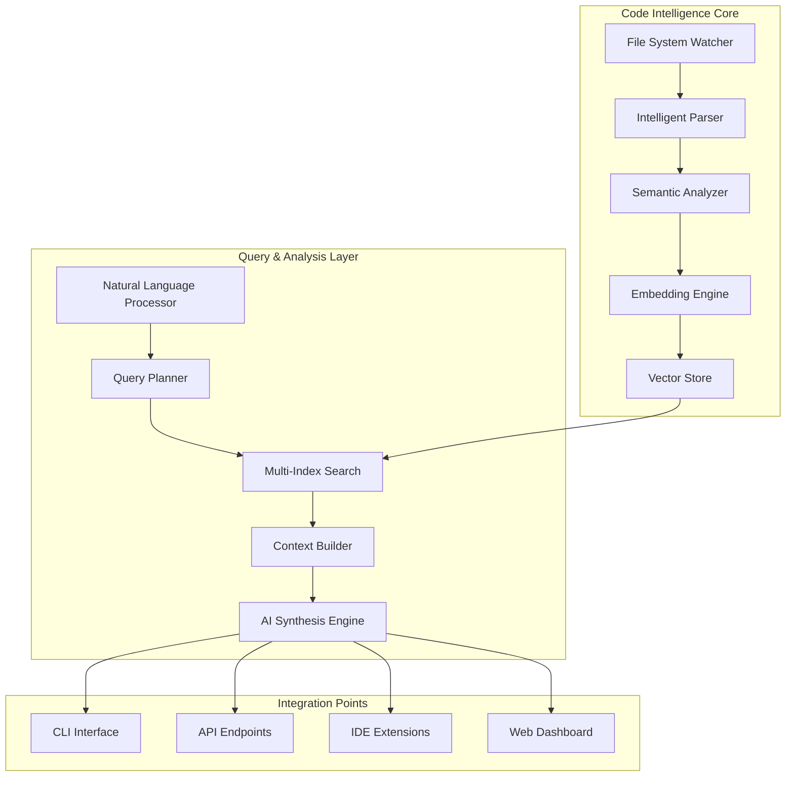

# FARM Code Intelligence System - Implementation Guide

## Executive Summary

The FARM Code Intelligence System represents a revolutionary leap in developer productivity, providing AI-powered code understanding that surpasses traditional IDEs. This system transforms your codebase into a living, queryable knowledge graph that understands not just syntax, but semantic meaning, architectural patterns, and developer intent.

### Revolutionary Features

- **Zero-Config Intelligence**: Works immediately upon `farm dev` with no setup required
- **Multi-Modal Understanding**: Comprehends code, comments, docs, and architectural patterns
- **Real-Time Insights**: Updates incrementally as you code, no manual re-indexing
- **Privacy-First**: All processing happens locally by default, with optional cloud acceleration
- **Framework-Aware**: Deep understanding of FARM patterns, React hooks, FastAPI routes
- **Natural Language Queries**: Ask questions about your codebase in plain English

---

## Architecture Overview

### System Components



### Data Flow Architecture

```typescript
// packages/code-intelligence/src/types/architecture.ts
export interface CodeIntelligenceArchitecture {
  ingestion: {
    crawler: FileCrawler;
    parser: MultiLanguageParser;
    analyzer: SemanticAnalyzer;
    embedder: EmbeddingEngine;
  };

  storage: {
    vectorStore: VectorDatabase;
    metadataStore: MetadataDatabase;
    cacheLayer: IntelligentCache;
  };

  query: {
    processor: NaturalLanguageProcessor;
    planner: QueryPlanner;
    executor: QueryExecutor;
    synthesizer: ResponseSynthesizer;
  };

  integration: {
    cli: CLIAdapter;
    api: APIAdapter;
    ide: IDEAdapter;
    web: WebAdapter;
  };
}
```

---

## Core Implementation

### 1. Intelligent Code Parser

```python
# packages/code-intelligence/src/parser/intelligent_parser.py
from abc import ABC, abstractmethod
from typing import List, Dict, Any, Optional
import ast
import re
from dataclasses import dataclass
from pathlib import Path
import libcst as cst
from tree_sitter import Language, Parser
import tiktoken

@dataclass
class CodeEntity:
    """Represents a parsed code entity with rich metadata"""
    id: str
    file_path: Path
    entity_type: str  # function, class, method, component, hook, etc.
    name: str
    content: str
    docstring: Optional[str]
    signature: Optional[str]
    dependencies: List[str]
    references: List[str]
    complexity: int
    tokens: int
    embedding: Optional[List[float]]
    metadata: Dict[str, Any]
    relationships: List['EntityRelationship']

@dataclass
class EntityRelationship:
    """Represents relationships between code entities"""
    source_id: str
    target_id: str
    relationship_type: str  # imports, extends, implements, uses, etc.
    metadata: Dict[str, Any]

class IntelligentParser:
    """Multi-language parser with deep semantic understanding"""

    def __init__(self):
        self.parsers = {
            '.py': PythonParser(),
            '.ts': TypeScriptParser(),
            '.tsx': ReactParser(),
            '.js': JavaScriptParser(),
            '.jsx': ReactParser(),
        }
        self.tokenizer = tiktoken.get_encoding("cl100k_base")

    async def parse_file(self, file_path: Path) -> List[CodeEntity]:
        """Parse a file into semantic code entities"""
        content = file_path.read_text(encoding='utf-8')
        suffix = file_path.suffix

        if suffix not in self.parsers:
            return self._parse_generic(file_path, content)

        parser = self.parsers[suffix]
        entities = await parser.parse(file_path, content)

        # Enrich with cross-file relationships
        for entity in entities:
            entity.relationships = await self._analyze_relationships(entity)
            entity.tokens = len(self.tokenizer.encode(entity.content))

        return entities

    async def _analyze_relationships(self, entity: CodeEntity) -> List[EntityRelationship]:
        """Analyze cross-file relationships and dependencies"""
        relationships = []

        # Analyze imports
        imports = self._extract_imports(entity.content, entity.file_path)
        for imp in imports:
            relationships.append(EntityRelationship(
                source_id=entity.id,
                target_id=self._resolve_import(imp, entity.file_path),
                relationship_type="imports",
                metadata={"import_type": imp.type}
            ))

        # Analyze function calls and references
        references = self._extract_references(entity.content)
        for ref in references:
            if resolved := self._resolve_reference(ref, entity.file_path):
                relationships.append(EntityRelationship(
                    source_id=entity.id,
                    target_id=resolved,
                    relationship_type="references",
                    metadata={"reference_type": ref.type}
                ))

        return relationships

class PythonParser:
    """Advanced Python parser with AST analysis"""

    async def parse(self, file_path: Path, content: str) -> List[CodeEntity]:
        entities = []
        tree = ast.parse(content)

        for node in ast.walk(tree):
            if isinstance(node, ast.FunctionDef):
                entity = self._parse_function(node, file_path, content)
                entities.append(entity)
            elif isinstance(node, ast.ClassDef):
                entity = self._parse_class(node, file_path, content)
                entities.append(entity)
                # Parse methods within class
                for item in node.body:
                    if isinstance(item, ast.FunctionDef):
                        method = self._parse_method(item, node, file_path, content)
                        entities.append(method)

        return entities

    def _parse_function(self, node: ast.FunctionDef, file_path: Path, content: str) -> CodeEntity:
        """Parse a function with full context"""
        return CodeEntity(
            id=f"{file_path}::{node.name}",
            file_path=file_path,
            entity_type="function",
            name=node.name,
            content=ast.get_source_segment(content, node),
            docstring=ast.get_docstring(node),
            signature=self._extract_signature(node),
            dependencies=self._extract_dependencies(node),
            references=[],  # Populated later
            complexity=self._calculate_complexity(node),
            tokens=0,  # Populated later
            embedding=None,  # Populated by embedder
            metadata={
                "async": isinstance(node, ast.AsyncFunctionDef),
                "decorators": [d.id for d in node.decorator_list if hasattr(d, 'id')],
                "line_start": node.lineno,
                "line_end": node.end_lineno,
                "parameters": self._extract_parameters(node),
                "return_type": self._extract_return_type(node),
            },
            relationships=[]  # Populated later
        )

class TypeScriptParser:
    """TypeScript/TSX parser with type understanding"""

    def __init__(self):
        # Initialize tree-sitter with TypeScript grammar
        self.parser = Parser()
        self.parser.set_language(Language('path/to/tree-sitter-typescript.so', 'typescript'))

    async def parse(self, file_path: Path, content: str) -> List[CodeEntity]:
        tree = self.parser.parse(bytes(content, 'utf8'))
        entities = []

        # Parse React components
        components = self._find_components(tree.root_node)
        for component in components:
            entity = self._parse_component(component, file_path, content)
            entities.append(entity)

        # Parse hooks
        hooks = self._find_hooks(tree.root_node)
        for hook in hooks:
            entity = self._parse_hook(hook, file_path, content)
            entities.append(entity)

        # Parse regular functions and classes
        functions = self._find_functions(tree.root_node)
        for func in functions:
            entity = self._parse_typescript_function(func, file_path, content)
            entities.append(entity)

        return entities
```

### 2. Semantic Analyzer

```python
# packages/code-intelligence/src/analyzer/semantic_analyzer.py
import networkx as nx
from typing import List, Dict, Set, Tuple
from collections import defaultdict
import numpy as np

class SemanticAnalyzer:
    """Analyzes code semantics and architectural patterns"""

    def __init__(self):
        self.graph = nx.DiGraph()
        self.pattern_detectors = [
            SingletonDetector(),
            FactoryDetector(),
            ObserverDetector(),
            RepositoryDetector(),
            ServiceLayerDetector(),
            ReactPatternDetector(),
        ]

    async def analyze_codebase(self, entities: List[CodeEntity]) -> CodebaseAnalysis:
        """Perform deep semantic analysis of the entire codebase"""

        # Build entity graph
        self._build_graph(entities)

        # Detect architectural patterns
        patterns = await self._detect_patterns()

        # Analyze code quality metrics
        metrics = await self._analyze_metrics()

        # Identify architectural layers
        layers = await self._identify_layers()

        # Find code smells and improvements
        improvements = await self._suggest_improvements()

        return CodebaseAnalysis(
            entity_count=len(entities),
            relationship_count=self.graph.number_of_edges(),
            patterns=patterns,
            metrics=metrics,
            layers=layers,
            improvements=improvements,
            hotspots=self._identify_hotspots(),
            dependencies=self._analyze_dependencies()
        )

    def _build_graph(self, entities: List[CodeEntity]):
        """Build a graph representation of the codebase"""
        for entity in entities:
            self.graph.add_node(entity.id, entity=entity)

        for entity in entities:
            for relationship in entity.relationships:
                self.graph.add_edge(
                    relationship.source_id,
                    relationship.target_id,
                    type=relationship.relationship_type,
                    metadata=relationship.metadata
                )

    async def _detect_patterns(self) -> List[ArchitecturalPattern]:
        """Detect architectural and design patterns"""
        patterns = []

        for detector in self.pattern_detectors:
            detected = await detector.detect(self.graph)
            patterns.extend(detected)

        return patterns

    def _identify_hotspots(self) -> List[Hotspot]:
        """Identify code hotspots that need attention"""
        hotspots = []

        # High coupling detection
        for node in self.graph.nodes():
            in_degree = self.graph.in_degree(node)
            out_degree = self.graph.out_degree(node)

            if in_degree > 10:  # Many dependencies
                hotspots.append(Hotspot(
                    entity_id=node,
                    type="high_coupling",
                    severity="high",
                    message=f"This entity has {in_degree} incoming dependencies"
                ))

        # Circular dependency detection
        cycles = list(nx.simple_cycles(self.graph))
        for cycle in cycles:
            hotspots.append(Hotspot(
                entity_id=cycle[0],
                type="circular_dependency",
                severity="critical",
                message=f"Circular dependency detected: {' -> '.join(cycle)}"
            ))

        return hotspots

class ReactPatternDetector:
    """Detects React-specific patterns and anti-patterns"""

    async def detect(self, graph: nx.DiGraph) -> List[ArchitecturalPattern]:
        patterns = []

        for node_id, data in graph.nodes(data=True):
            entity = data['entity']

            # Detect custom hooks
            if entity.name.startswith('use') and entity.entity_type == 'function':
                patterns.append(ArchitecturalPattern(
                    type="react_custom_hook",
                    entities=[entity.id],
                    confidence=0.95,
                    metadata={"hook_name": entity.name}
                ))

            # Detect HOCs
            if self._is_hoc(entity):
                patterns.append(ArchitecturalPattern(
                    type="higher_order_component",
                    entities=[entity.id],
                    confidence=0.9,
                    metadata={"hoc_name": entity.name}
                ))

        return patterns
```

### 3. Embedding Engine

```python
# packages/code-intelligence/src/embeddings/engine.py
from sentence_transformers import SentenceTransformer
import torch
from typing import List, Dict, Optional
import numpy as np
from transformers import AutoTokenizer, AutoModel

class HybridEmbeddingEngine:
    """Advanced embedding engine with code-specific models"""

    def __init__(self, device: str = None):
        self.device = device or ('cuda' if torch.cuda.is_available() else 'cpu')

        # Multiple embedding models for different purposes
        self.models = {
            'semantic': SentenceTransformer('sentence-transformers/all-mpnet-base-v2'),
            'code': CodeBERTModel(),  # Microsoft CodeBERT
            'doc': SentenceTransformer('sentence-transformers/multi-qa-mpnet-base-dot-v1'),
        }

        # Move models to device
        for model in self.models.values():
            model.to(self.device)

    async def embed_entity(self, entity: CodeEntity) -> np.ndarray:
        """Generate rich embeddings for a code entity"""

        # Generate multiple embeddings
        embeddings = []

        # Code structure embedding
        code_embedding = await self._embed_code(entity.content)
        embeddings.append(code_embedding)

        # Docstring embedding (if available)
        if entity.docstring:
            doc_embedding = await self._embed_documentation(entity.docstring)
            embeddings.append(doc_embedding)

        # Name and signature embedding
        signature_text = f"{entity.name} {entity.signature or ''}"
        sig_embedding = await self._embed_semantic(signature_text)
        embeddings.append(sig_embedding)

        # Combine embeddings with attention
        combined = self._combine_embeddings(embeddings, entity)

        return combined

    async def _embed_code(self, code: str) -> np.ndarray:
        """Embed code using code-specific model"""
        model = self.models['code']

        # Tokenize and embed
        with torch.no_grad():
            embedding = model.encode(code, max_length=512)

        return embedding

    def _combine_embeddings(self, embeddings: List[np.ndarray], entity: CodeEntity) -> np.ndarray:
        """Intelligently combine multiple embeddings"""

        # Weight based on entity type
        weights = self._calculate_weights(entity)

        # Weighted average
        combined = np.zeros_like(embeddings[0])
        for emb, weight in zip(embeddings, weights):
            combined += emb * weight

        # Normalize
        combined = combined / np.linalg.norm(combined)

        return combined

class CodeBERTModel:
    """Wrapper for Microsoft CodeBERT model"""

    def __init__(self):
        self.tokenizer = AutoTokenizer.from_pretrained("microsoft/codebert-base")
        self.model = AutoModel.from_pretrained("microsoft/codebert-base")

    def encode(self, code: str, max_length: int = 512) -> np.ndarray:
        inputs = self.tokenizer(
            code,
            return_tensors="pt",
            max_length=max_length,
            truncation=True,
            padding=True
        )

        with torch.no_grad():
            outputs = self.model(**inputs)

        # Use CLS token embedding
        embedding = outputs.last_hidden_state[:, 0, :].squeeze().numpy()

        return embedding
```

### 4. Vector Database Layer

```python
# packages/code-intelligence/src/storage/vector_store.py
import chromadb
from chromadb.config import Settings
import qdrant_client
from typing import List, Dict, Optional, Union
import numpy as np
from abc import ABC, abstractmethod

class VectorStore(ABC):
    """Abstract base class for vector storage backends"""

    @abstractmethod
    async def add_entities(self, entities: List[CodeEntity]) -> None:
        pass

    @abstractmethod
    async def search(self, query_embedding: np.ndarray, k: int = 5) -> List[SearchResult]:
        pass

    @abstractmethod
    async def update_entity(self, entity: CodeEntity) -> None:
        pass

    @abstractmethod
    async def delete_entity(self, entity_id: str) -> None:
        pass

class HybridVectorStore(VectorStore):
    """Production-ready vector store with multiple backends"""

    def __init__(self, config: VectorStoreConfig):
        self.config = config

        # Initialize primary store (local)
        self.local_store = ChromaVectorStore(
            path=config.local_path,
            collection_name="code_entities"
        )

        # Initialize cloud store (optional)
        self.cloud_store = None
        if config.enable_cloud:
            self.cloud_store = QdrantVectorStore(
                url=config.cloud_url,
                api_key=config.cloud_api_key
            )

        # Initialize cache
        self.cache = InMemoryCache(max_size=1000)

    async def add_entities(self, entities: List[CodeEntity]) -> None:
        """Add entities with automatic sharding and replication"""

        # Prepare batch
        embeddings = []
        metadatas = []
        ids = []

        for entity in entities:
            embeddings.append(entity.embedding)
            metadatas.append(self._entity_to_metadata(entity))
            ids.append(entity.id)

        # Add to local store
        await self.local_store.add_batch(ids, embeddings, metadatas)

        # Replicate to cloud (async)
        if self.cloud_store:
            asyncio.create_task(
                self.cloud_store.add_batch(ids, embeddings, metadatas)
            )

        # Update cache
        for entity in entities:
            self.cache.put(entity.id, entity)

    async def search(self, query_embedding: np.ndarray, k: int = 5, filters: Dict = None) -> List[SearchResult]:
        """Hybrid search with fallback and result fusion"""

        # Check cache first
        cache_key = self._cache_key(query_embedding, k, filters)
        if cached := self.cache.get(cache_key):
            return cached

        # Search local store
        local_results = await self.local_store.search(query_embedding, k * 2, filters)

        # Search cloud store if available
        cloud_results = []
        if self.cloud_store and self.config.use_cloud_search:
            try:
                cloud_results = await self.cloud_store.search(query_embedding, k * 2, filters)
            except Exception as e:
                # Log but don't fail
                logger.warning(f"Cloud search failed: {e}")

        # Fuse results
        fused_results = self._fuse_results(local_results, cloud_results, k)

        # Cache results
        self.cache.put(cache_key, fused_results)

        return fused_results

    def _fuse_results(self, local: List[SearchResult], cloud: List[SearchResult], k: int) -> List[SearchResult]:
        """Intelligently fuse results from multiple sources"""

        # Deduplicate by ID
        seen = set()
        all_results = []

        for result in local + cloud:
            if result.id not in seen:
                seen.add(result.id)
                all_results.append(result)

        # Re-rank using reciprocal rank fusion
        scores = {}
        for i, result in enumerate(local):
            scores[result.id] = scores.get(result.id, 0) + 1 / (i + 1)
        for i, result in enumerate(cloud):
            scores[result.id] = scores.get(result.id, 0) + 1 / (i + 1)

        # Sort by fused score
        all_results.sort(key=lambda r: scores.get(r.id, 0), reverse=True)

        return all_results[:k]

class ChromaVectorStore:
    """ChromaDB implementation for local vector storage"""

    def __init__(self, path: str, collection_name: str):
        self.client = chromadb.PersistentClient(
            path=path,
            settings=Settings(
                anonymized_telemetry=False,
                allow_reset=True
            )
        )
        self.collection = self.client.get_or_create_collection(
            name=collection_name,
            metadata={"hnsw:space": "cosine"}
        )
```

### 5. Query Engine

````python
# packages/code-intelligence/src/query/engine.py
from typing import List, Dict, Optional, Union
import asyncio
from dataclasses import dataclass
import json

@dataclass
class QueryPlan:
    """Execution plan for a code intelligence query"""
    query_type: str  # search, explain, analyze, generate
    search_strategy: str  # semantic, keyword, hybrid
    filters: Dict[str, Any]
    include_context: bool
    max_results: int
    use_ai_synthesis: bool

class CodeQueryEngine:
    """Advanced query engine with multi-strategy search"""

    def __init__(self, vector_store: VectorStore, analyzer: SemanticAnalyzer, ai_provider: AIProvider):
        self.vector_store = vector_store
        self.analyzer = analyzer
        self.ai_provider = ai_provider
        self.query_planner = QueryPlanner()

    async def query(self, natural_query: str, context: QueryContext = None) -> QueryResponse:
        """Execute a natural language query against the codebase"""

        # Generate query plan
        plan = await self.query_planner.plan(natural_query, context)

        # Execute based on query type
        if plan.query_type == "search":
            return await self._execute_search(natural_query, plan)
        elif plan.query_type == "explain":
            return await self._execute_explain(natural_query, plan)
        elif plan.query_type == "analyze":
            return await self._execute_analyze(natural_query, plan)
        elif plan.query_type == "generate":
            return await self._execute_generate(natural_query, plan)
        else:
            return await self._execute_hybrid(natural_query, plan)

    async def _execute_search(self, query: str, plan: QueryPlan) -> QueryResponse:
        """Execute semantic search query"""

        # Generate query embedding
        query_embedding = await self.embedder.embed_text(query)

        # Search with filters
        results = await self.vector_store.search(
            query_embedding,
            k=plan.max_results,
            filters=plan.filters
        )

        # Enrich with context if requested
        if plan.include_context:
            results = await self._enrich_with_context(results)

        # Synthesize response if requested
        if plan.use_ai_synthesis:
            synthesis = await self._synthesize_response(query, results)
            return QueryResponse(
                results=results,
                synthesis=synthesis,
                plan=plan
            )

        return QueryResponse(results=results, plan=plan)

    async def _execute_explain(self, query: str, plan: QueryPlan) -> QueryResponse:
        """Execute explanation query"""

        # Extract entity name from query
        entity_name = self._extract_entity_name(query)

        # Find entity
        entity_results = await self._find_entity(entity_name)

        if not entity_results:
            return QueryResponse(
                results=[],
                synthesis="Entity not found",
                plan=plan
            )

        # Get full context
        entity = entity_results[0]
        context = await self._build_entity_context(entity)

        # Generate explanation
        explanation = await self._generate_explanation(entity, context)

        return QueryResponse(
            results=entity_results,
            synthesis=explanation,
            plan=plan,
            context=context
        )

    async def _build_entity_context(self, entity: CodeEntity) -> EntityContext:
        """Build comprehensive context for an entity"""

        # Get related entities
        related = await self._get_related_entities(entity)

        # Get usage examples
        usages = await self._find_usages(entity)

        # Get tests
        tests = await self._find_tests(entity)

        # Get documentation
        docs = await self._find_documentation(entity)

        return EntityContext(
            entity=entity,
            related=related,
            usages=usages,
            tests=tests,
            documentation=docs,
            call_graph=await self._build_call_graph(entity),
            data_flow=await self._analyze_data_flow(entity)
        )

    async def _synthesize_response(self, query: str, results: List[SearchResult]) -> str:
        """Use AI to synthesize a natural language response"""

        # Build context from results
        context = "\n\n".join([
            f"File: {r.metadata['file_path']}\n"
            f"Type: {r.metadata['entity_type']}\n"
            f"Name: {r.metadata['name']}\n"
            f"```{r.metadata.get('language', 'python')}\n{r.content}\n```"
            for r in results[:5]
        ])

        # Generate synthesis
        prompt = f"""
        Based on the following code context, answer this question: {query}

        Context:
        {context}

        Provide a clear, concise answer that references specific code elements.
        """

        response = await self.ai_provider.generate(
            prompt,
            system="You are a senior software architect analyzing code."
        )

        return response

class QueryPlanner:
    """Plans optimal execution strategy for queries"""

    def __init__(self):
        self.intent_classifier = IntentClassifier()
        self.filter_extractor = FilterExtractor()

    async def plan(self, query: str, context: QueryContext = None) -> QueryPlan:
        """Generate an execution plan for a query"""

        # Classify query intent
        intent = await self.intent_classifier.classify(query)

        # Extract filters
        filters = await self.filter_extractor.extract(query)

        # Determine strategy
        if "how does" in query.lower() or "explain" in query.lower():
            return QueryPlan(
                query_type="explain",
                search_strategy="semantic",
                filters=filters,
                include_context=True,
                max_results=10,
                use_ai_synthesis=True
            )
        elif "analyze" in query.lower() or "find issues" in query.lower():
            return QueryPlan(
                query_type="analyze",
                search_strategy="hybrid",
                filters=filters,
                include_context=True,
                max_results=20,
                use_ai_synthesis=True
            )
        else:
            return QueryPlan(
                query_type="search",
                search_strategy="semantic",
                filters=filters,
                include_context=False,
                max_results=5,
                use_ai_synthesis=False
            )
````

### 6. API Integration Layer

```python
# packages/code-intelligence/src/api/routes.py
from fastapi import APIRouter, HTTPException, BackgroundTasks
from typing import List, Optional
from pydantic import BaseModel

router = APIRouter(prefix="/api/code-intelligence", tags=["code-intelligence"])

class QueryRequest(BaseModel):
    query: str
    max_results: Optional[int] = 5
    include_context: Optional[bool] = False
    filters: Optional[Dict[str, Any]] = None

class ExplainRequest(BaseModel):
    entity_name: str
    include_examples: Optional[bool] = True
    include_tests: Optional[bool] = True

class IndexStatusResponse(BaseModel):
    indexed_files: int
    total_entities: int
    last_updated: datetime
    index_health: str
    vector_count: int

@router.post("/query")
async def query_codebase(request: QueryRequest) -> QueryResponse:
    """Execute a natural language query against the codebase"""
    try:
        response = await code_query_engine.query(
            request.query,
            context=QueryContext(
                max_results=request.max_results,
                include_context=request.include_context,
                filters=request.filters
            )
        )
        return response
    except Exception as e:
        logger.error(f"Query failed: {e}")
        raise HTTPException(status_code=500, detail=str(e))

@router.post("/explain")
async def explain_entity(request: ExplainRequest) -> ExplanationResponse:
    """Get detailed explanation of a code entity"""
    context = await code_query_engine.get_entity_context(
        request.entity_name,
        include_examples=request.include_examples,
        include_tests=request.include_tests
    )

    if not context:
        raise HTTPException(status_code=404, detail="Entity not found")

    explanation = await code_query_engine.explain_entity(context)

    return ExplanationResponse(
        entity=context.entity,
        explanation=explanation,
        context=context
    )

@router.get("/status")
async def get_index_status() -> IndexStatusResponse:
    """Get current status of the code intelligence index"""
    status = await index_manager.get_status()
    return IndexStatusResponse(**status)

@router.post("/reindex")
async def reindex_codebase(background_tasks: BackgroundTasks):
    """Trigger a full reindex of the codebase"""
    background_tasks.add_task(index_manager.full_reindex)
    return {"message": "Reindex started", "task_id": str(uuid.uuid4())}

@router.websocket("/stream")
async def stream_query_results(websocket: WebSocket):
    """WebSocket endpoint for streaming query results"""
    await websocket.accept()

    try:
        while True:
            data = await websocket.receive_json()
            query = data.get("query")

            # Stream results as they're found
            async for result in code_query_engine.stream_query(query):
                await websocket.send_json({
                    "type": "result",
                    "data": result.dict()
                })

            await websocket.send_json({"type": "complete"})

    except WebSocketDisconnect:
        pass
```

### 7. CLI Integration

```typescript
// packages/cli/src/commands/intelligence.ts
import { Command } from "commander";
import { CodeIntelligenceClient } from "@farm/code-intelligence-client";
import chalk from "chalk";
import ora from "ora";
import inquirer from "inquirer";

export class IntelligenceCommand {
  private client: CodeIntelligenceClient;

  constructor() {
    this.client = new CodeIntelligenceClient({
      baseUrl: "http://localhost:8000/api/code-intelligence",
    });
  }

  register(program: Command) {
    const intel = program
      .command("intel")
      .alias("ai")
      .description("AI-powered code intelligence");

    // Search command
    intel
      .command("search <query>")
      .description("Search codebase using natural language")
      .option("-n, --max-results <number>", "Maximum results", "5")
      .option("-c, --context", "Include context", false)
      .action(async (query, options) => {
        const spinner = ora("Searching codebase...").start();

        try {
          const results = await this.client.query({
            query,
            maxResults: parseInt(options.maxResults),
            includeContext: options.context,
          });

          spinner.succeed("Search complete");
          this.displayResults(results);
        } catch (error) {
          spinner.fail(`Search failed: ${error.message}`);
        }
      });

    // Explain command
    intel
      .command("explain <entity>")
      .description("Get detailed explanation of a code entity")
      .option("-e, --examples", "Include usage examples", true)
      .option("-t, --tests", "Include related tests", true)
      .action(async (entity, options) => {
        const spinner = ora(`Analyzing ${entity}...`).start();

        try {
          const explanation = await this.client.explain({
            entityName: entity,
            includeExamples: options.examples,
            includeTests: options.tests,
          });

          spinner.succeed("Analysis complete");
          this.displayExplanation(explanation);
        } catch (error) {
          spinner.fail(`Analysis failed: ${error.message}`);
        }
      });

    // Ask command - Interactive mode
    intel
      .command("ask")
      .description("Interactive code intelligence assistant")
      .action(async () => {
        console.log(chalk.cyan("🤖 FARM Code Intelligence Assistant"));
        console.log(chalk.gray('Type "exit" to quit\n'));

        while (true) {
          const { question } = await inquirer.prompt([
            {
              type: "input",
              name: "question",
              message: chalk.green("Ask me anything about your code:"),
              prefix: "",
            },
          ]);

          if (question.toLowerCase() === "exit") break;

          const spinner = ora("Thinking...").start();

          try {
            const response = await this.client.query({
              query: question,
              includeContext: true,
              useAiSynthesis: true,
            });

            spinner.stop();

            if (response.synthesis) {
              console.log(chalk.cyan("\n📝 Answer:"));
              console.log(response.synthesis);
            }

            if (response.results.length > 0) {
              console.log(chalk.cyan("\n📍 Relevant code:"));
              response.results.slice(0, 3).forEach((result, i) => {
                console.log(
                  chalk.gray(
                    `${i + 1}. ${result.file}:${result.line} - ${result.name}`
                  )
                );
              });
            }

            console.log("");
          } catch (error) {
            spinner.fail(`Error: ${error.message}`);
          }
        }
      });

    // Index command
    intel
      .command("index")
      .description("Manage code intelligence index")
      .option("-w, --watch", "Watch for changes", false)
      .option("-f, --force", "Force full reindex", false)
      .action(async (options) => {
        if (options.force) {
          const spinner = ora("Reindexing codebase...").start();
          await this.client.reindex();
          spinner.succeed("Reindex complete");
        } else if (options.watch) {
          console.log(chalk.cyan("👀 Watching for changes..."));
          await this.watchForChanges();
        } else {
          const status = await this.client.getStatus();
          this.displayStatus(status);
        }
      });
  }

  private displayResults(results: QueryResponse) {
    if (results.synthesis) {
      console.log(chalk.cyan("\n📝 Summary:"));
      console.log(results.synthesis);
    }

    console.log(chalk.cyan("\n🔍 Results:"));
    results.results.forEach((result, i) => {
      console.log(chalk.bold(`\n${i + 1}. ${result.name} (${result.type})`));
      console.log(chalk.gray(`   ${result.file}:${result.line}`));

      if (result.preview) {
        console.log(chalk.dim("   " + result.preview.slice(0, 100) + "..."));
      }
    });
  }
}
```

### 8. IDE Integration

```typescript
// packages/vscode-extension/src/code-intelligence.ts
import * as vscode from "vscode";
import { CodeIntelligenceClient } from "@farm/code-intelligence-client";

export class FarmCodeIntelligenceProvider
  implements
    vscode.HoverProvider,
    vscode.DefinitionProvider,
    vscode.CodeLensProvider
{
  private client: CodeIntelligenceClient;
  private decorationType: vscode.TextEditorDecorationType;

  constructor() {
    this.client = new CodeIntelligenceClient();
    this.decorationType = vscode.window.createTextEditorDecorationType({
      after: {
        contentText: "🧠",
        margin: "0 0 0 1em",
        color: new vscode.ThemeColor("editorCodeLens.foreground"),
      },
    });
  }

  async provideHover(
    document: vscode.TextDocument,
    position: vscode.Position,
    token: vscode.CancellationToken
  ): Promise<vscode.Hover | null> {
    const wordRange = document.getWordRangeAtPosition(position);
    if (!wordRange) return null;

    const word = document.getText(wordRange);

    try {
      const explanation = await this.client.explain({
        entityName: word,
        includeExamples: false,
      });

      const markdown = new vscode.MarkdownString();
      markdown.isTrusted = true;

      // Add explanation
      markdown.appendMarkdown(`**${explanation.entity.name}**\n\n`);
      markdown.appendMarkdown(explanation.explanation + "\n\n");

      // Add signature if available
      if (explanation.entity.signature) {
        markdown.appendCodeblock(explanation.entity.signature, "typescript");
      }

      // Add links
      markdown.appendMarkdown(
        "\n\n[🔍 Find usages](command:farm.findUsages) | "
      );
      markdown.appendMarkdown(
        "[📊 View relationships](command:farm.viewRelationships)"
      );

      return new vscode.Hover(markdown, wordRange);
    } catch (error) {
      return null;
    }
  }

  async provideCodeLenses(
    document: vscode.TextDocument,
    token: vscode.CancellationToken
  ): Promise<vscode.CodeLens[]> {
    const codeLenses: vscode.CodeLens[] = [];

    // Find all function/class definitions
    const text = document.getText();
    const functionRegex = /(?:async\s+)?(?:function|class)\s+(\w+)/g;

    let match;
    while ((match = functionRegex.exec(text)) !== null) {
      const position = document.positionAt(match.index);
      const range = new vscode.Range(position, position);

      // Add "Explain" lens
      codeLenses.push(
        new vscode.CodeLens(range, {
          title: "🧠 Explain",
          command: "farm.explain",
          arguments: [match[1]],
        })
      );

      // Add "Find usages" lens
      codeLenses.push(
        new vscode.CodeLens(range, {
          title: "🔍 Find usages",
          command: "farm.findUsages",
          arguments: [match[1]],
        })
      );
    }

    return codeLenses;
  }
}

// Command palette integration
export function registerCommands(context: vscode.ExtensionContext) {
  // Quick search command
  context.subscriptions.push(
    vscode.commands.registerCommand("farm.quickSearch", async () => {
      const query = await vscode.window.showInputBox({
        prompt: "Search your codebase",
        placeHolder:
          'e.g., "authentication flow" or "how does user login work?"',
      });

      if (!query) return;

      const results = await searchCodebase(query);
      showSearchResults(results);
    })
  );

  // AI chat panel
  context.subscriptions.push(
    vscode.commands.registerCommand("farm.openAIChat", () => {
      FarmAIChatPanel.createOrShow(context.extensionUri);
    })
  );
}
```

### 9. Web Dashboard

```typescript
// packages/web-dashboard/src/components/CodeIntelligenceDashboard.tsx
import React, { useState, useEffect } from 'react';
import { useCodeIntelligence } from '@farm/hooks';
import { NetworkGraph } from './NetworkGraph';
import { SearchInterface } from './SearchInterface';
import { MetricsPanel } from './MetricsPanel';
import { HotspotsList } from './HotspotsList';

export function CodeIntelligenceDashboard() {
  const { status, search, analyze, reindex } = useCodeIntelligence();
  const [selectedEntity, setSelectedEntity] = useState(null);
  const [graphData, setGraphData] = useState(null);

  useEffect(() => {
    // Load initial graph data
    loadGraphData();
  }, []);

  return (
    <div className="grid grid-cols-12 gap-4 h-screen p-4">
      {/* Search Panel */}
      <div className="col-span-3 space-y-4">
        <SearchInterface
          onSearch={handleSearch}
          onEntitySelect={setSelectedEntity}
        />

        <MetricsPanel status={status} />

        <HotspotsList
          hotspots={status?.hotspots}
          onSelect={setSelectedEntity}
        />
      </div>

      {/* Main Visualization */}
      <div className="col-span-6 bg-gray-900 rounded-lg p-4">
        <NetworkGraph
          data={graphData}
          selectedEntity={selectedEntity}
          onEntityClick={setSelectedEntity}
        />
      </div>

      {/* Detail Panel */}
      <div className="col-span-3 space-y-4">
        {selectedEntity && (
          <EntityDetailPanel
            entity={selectedEntity}
            onRelatedClick={setSelectedEntity}
          />
        )}
      </div>
    </div>
  );
}

function EntityDetailPanel({ entity, onRelatedClick }) {
  const [explanation, setExplanation] = useState(null);
  const [loading, setLoading] = useState(false);

  useEffect(() => {
    loadExplanation();
  }, [entity]);

  const loadExplanation = async () => {
    setLoading(true);
    try {
      const result = await explainEntity(entity.id);
      setExplanation(result);
    } finally {
      setLoading(false);
    }
  };

  return (
    <div className="bg-gray-800 rounded-lg p-4">
      <h3 className="text-lg font-semibold mb-2">{entity.name}</h3>
      <p className="text-sm text-gray-400 mb-4">{entity.type} • {entity.file}</p>

      {loading ? (
        <Spinner />
      ) : explanation && (
        <>
          <Section title="Summary">
            <p className="text-sm">{explanation.summary}</p>
          </Section>

          <Section title="Dependencies">
            <DependencyList
              dependencies={explanation.dependencies}
              onClick={onRelatedClick}
            />
          </Section>

          <Section title="Used By">
            <UsageList
              usages={explanation.usages}
              onClick={onRelatedClick}
            />
          </Section>

          <Section title="Code">
            <CodeBlock
              code={entity.content}
              language={entity.language}
            />
          </Section>
        </>
      )}
    </div>
  );
}
```

---

## Shared Types & Interfaces

```typescript
// packages/code-intelligence/src/types/index.ts

// Core entity types
export interface CodeEntity {
  id: string;
  filePath: string;
  entityType: EntityType;
  name: string;
  content: string;
  docstring?: string;
  signature?: string;
  dependencies: string[];
  references: string[];
  complexity: number;
  tokens: number;
  embedding?: number[];
  metadata: EntityMetadata;
  relationships: EntityRelationship[];
  position: CodePosition;
}

export enum EntityType {
  Function = "function",
  Class = "class",
  Method = "method",
  Component = "component",
  Hook = "hook",
  Interface = "interface",
  Type = "type",
  Enum = "enum",
  Variable = "variable",
  Module = "module",
}

export interface EntityMetadata {
  async?: boolean;
  exported?: boolean;
  decorators?: string[];
  modifiers?: string[];
  language: string;
  framework?: string;
  [key: string]: any;
}

export interface EntityRelationship {
  sourceId: string;
  targetId: string;
  relationshipType: RelationshipType;
  metadata?: Record<string, any>;
}

export enum RelationshipType {
  Imports = "imports",
  Extends = "extends",
  Implements = "implements",
  Uses = "uses",
  UsedBy = "usedBy",
  Contains = "contains",
  ContainedBy = "containedBy",
  Tests = "tests",
  TestedBy = "testedBy",
}

// Query types
export interface QueryRequest {
  query: string;
  maxResults?: number;
  includeContext?: boolean;
  filters?: QueryFilters;
  options?: QueryOptions;
}

export interface QueryFilters {
  entityTypes?: EntityType[];
  filePatterns?: string[];
  languages?: string[];
  frameworks?: string[];
  dateRange?: DateRange;
  complexity?: ComplexityRange;
}

export interface QueryOptions {
  useAiSynthesis?: boolean;
  includeRelationships?: boolean;
  includeDependencies?: boolean;
  includeMetrics?: boolean;
  groupBy?: string;
}

export interface QueryResponse {
  results: SearchResult[];
  synthesis?: string;
  plan?: QueryPlan;
  context?: QueryContext;
  metrics?: QueryMetrics;
  error?: string;
}

export interface SearchResult {
  id: string;
  score: number;
  entity: CodeEntity;
  highlights?: string[];
  explanation?: string;
  relevantContext?: CodeEntity[];
}

// Analysis types
export interface CodebaseAnalysis {
  entityCount: number;
  relationshipCount: number;
  patterns: ArchitecturalPattern[];
  metrics: CodebaseMetrics;
  layers: ArchitecturalLayer[];
  improvements: Improvement[];
  hotspots: Hotspot[];
  dependencies: DependencyAnalysis;
}

export interface ArchitecturalPattern {
  type: string;
  entities: string[];
  confidence: number;
  metadata?: Record<string, any>;
}

export interface Hotspot {
  entityId: string;
  type: string;
  severity: "low" | "medium" | "high" | "critical";
  message: string;
  suggestions?: string[];
}

// WebSocket types for real-time updates
export interface IntelligenceWebSocketMessage {
  type: "entity_updated" | "index_progress" | "analysis_complete" | "error";
  data: any;
  timestamp: string;
}

// API response types
export interface IndexStatus {
  indexedFiles: number;
  totalEntities: number;
  lastUpdated: Date;
  indexHealth: "healthy" | "degraded" | "rebuilding";
  vectorCount: number;
  processingQueue: number;
  errors: IndexError[];
}

export interface ExplanationResponse {
  entity: CodeEntity;
  explanation: string;
  context?: EntityContext;
  examples?: CodeExample[];
  tests?: TestCase[];
}
```

---

## Performance & Optimization

### Incremental Indexing

```python
# packages/code-intelligence/src/indexing/incremental.py
class IncrementalIndexer:
    """Handles incremental updates to minimize re-indexing"""

    def __init__(self, indexer: CodeIndexer):
        self.indexer = indexer
        self.file_hashes = {}
        self.dependency_graph = nx.DiGraph()

    async def handle_file_change(self, file_path: Path, change_type: str):
        """Handle a single file change efficiently"""

        if change_type == 'deleted':
            await self._handle_deletion(file_path)
        else:
            # Check if file actually changed
            new_hash = self._compute_hash(file_path)
            old_hash = self.file_hashes.get(str(file_path))

            if new_hash != old_hash:
                # Identify affected entities
                affected = await self._find_affected_entities(file_path)

                # Re-index only what's necessary
                await self._incremental_reindex(file_path, affected)

                # Update hash
                self.file_hashes[str(file_path)] = new_hash

    async def _find_affected_entities(self, file_path: Path) -> Set[str]:
        """Find all entities affected by a file change"""
        affected = set()

        # Direct entities in the file
        file_entities = await self.indexer.get_file_entities(file_path)
        affected.update([e.id for e in file_entities])

        # Entities that import from this file
        importers = self.dependency_graph.predecessors(str(file_path))
        for importer in importers:
            importer_entities = await self.indexer.get_file_entities(Path(importer))
            affected.update([e.id for e in importer_entities])

        return affected
```

### Caching Strategy

```typescript
// packages/code-intelligence/src/cache/intelligent-cache.ts
export class IntelligentCache {
  private memoryCache: LRUCache<string, any>;
  private diskCache: DiskCache;
  private cacheStats: CacheStatistics;

  constructor(config: CacheConfig) {
    this.memoryCache = new LRUCache({
      max: config.maxMemoryItems || 10000,
      ttl: config.ttl || 1000 * 60 * 60, // 1 hour
      updateAgeOnGet: true,
    });

    this.diskCache = new DiskCache({
      directory: config.diskCacheDir || ".farm/cache",
      maxSize: config.maxDiskSize || 1024 * 1024 * 1024, // 1GB
    });
  }

  async get(key: string): Promise<any | null> {
    // Check memory cache first
    const memResult = this.memoryCache.get(key);
    if (memResult) {
      this.cacheStats.memoryHits++;
      return memResult;
    }

    // Check disk cache
    const diskResult = await this.diskCache.get(key);
    if (diskResult) {
      this.cacheStats.diskHits++;
      // Promote to memory cache
      this.memoryCache.set(key, diskResult);
      return diskResult;
    }

    this.cacheStats.misses++;
    return null;
  }

  async set(key: string, value: any, options?: CacheOptions): Promise<void> {
    // Always set in memory cache
    this.memoryCache.set(key, value);

    // Selectively persist to disk based on value characteristics
    if (this.shouldPersistToDisk(value, options)) {
      await this.diskCache.set(key, value);
    }
  }

  private shouldPersistToDisk(value: any, options?: CacheOptions): boolean {
    // Persist expensive computations
    if (options?.expensive) return true;

    // Persist large results
    if (JSON.stringify(value).length > 10000) return true;

    // Don't persist frequently changing data
    if (options?.volatile) return false;

    return false;
  }
}
```

---

## Security & Privacy

### Local-First Architecture

```python
# packages/code-intelligence/src/security/privacy.py
class PrivacyManager:
    """Ensures code intelligence respects privacy and security"""

    def __init__(self, config: PrivacyConfig):
        self.config = config
        self.filters = self._load_filters()

    def should_index_file(self, file_path: Path) -> bool:
        """Check if a file should be indexed"""

        # Check gitignore patterns
        if self._is_gitignored(file_path):
            return False

        # Check explicit excludes
        for pattern in self.config.exclude_patterns:
            if file_path.match(pattern):
                return False

        # Check for sensitive files
        if self._is_sensitive(file_path):
            return False

        return True

    def sanitize_content(self, content: str, file_path: Path) -> str:
        """Remove sensitive information before indexing"""

        # Remove API keys and secrets
        content = self._remove_secrets(content)

        # Remove personal information
        content = self._remove_pii(content)

        # Remove internal URLs
        content = self._remove_internal_urls(content)

        return content

    def _remove_secrets(self, content: str) -> str:
        """Remove potential secrets and API keys"""
        patterns = [
            r'api[_-]?key\s*=\s*["\']([^"\']+)["\']',
            r'secret[_-]?key\s*=\s*["\']([^"\']+)["\']',
            r'password\s*=\s*["\']([^"\']+)["\']',
            r'token\s*=\s*["\']([^"\']+)["\']',
        ]

        for pattern in patterns:
            content = re.sub(pattern, '***REDACTED***', content, flags=re.IGNORECASE)

        return content
```

---

## Testing Strategy

### Unit Tests

```python
# packages/code-intelligence/tests/test_parser.py
import pytest
from pathlib import Path
from farm.code_intelligence import IntelligentParser, CodeEntity

class TestIntelligentParser:
    @pytest.fixture
    def parser(self):
        return IntelligentParser()

    @pytest.mark.asyncio
    async def test_parse_python_function(self, parser, tmp_path):
        # Create test file
        test_file = tmp_path / "test.py"
        test_file.write_text("""
def calculate_total(items: List[Item]) -> float:
    '''Calculate total price of items'''
    return sum(item.price for item in items)
        """)

        # Parse file
        entities = await parser.parse_file(test_file)

        # Verify results
        assert len(entities) == 1
        entity = entities[0]
        assert entity.name == "calculate_total"
        assert entity.entity_type == "function"
        assert entity.docstring == "Calculate total price of items"
        assert "items: List[Item]" in entity.signature
        assert "-> float" in entity.signature

    @pytest.mark.asyncio
    async def test_parse_react_component(self, parser, tmp_path):
        # Create test file
        test_file = tmp_path / "Component.tsx"
        test_file.write_text("""
export function UserProfile({ user }: { user: User }) {
    const [isEditing, setIsEditing] = useState(false);

    return (
        <div>
            <h1>{user.name}</h1>
            <EditButton onClick={() => setIsEditing(true)} />
        </div>
    );
}
        """)

        # Parse file
        entities = await parser.parse_file(test_file)

        # Verify component detection
        component = next(e for e in entities if e.name == "UserProfile")
        assert component.entity_type == "component"
        assert component.metadata["framework"] == "react"
        assert "useState" in component.dependencies
```

### Integration Tests

```typescript
// packages/code-intelligence/tests/integration/search.test.ts
import { CodeIntelligenceServer } from "../src/server";
import { TestProject } from "../fixtures/test-project";

describe("Code Intelligence Search", () => {
  let server: CodeIntelligenceServer;
  let project: TestProject;

  beforeAll(async () => {
    // Create test project
    project = await TestProject.create({
      files: {
        "src/auth/login.ts": `
          export async function login(email: string, password: string) {
            const user = await db.users.findOne({ email });
            if (!user) throw new Error('User not found');
            
            const valid = await bcrypt.compare(password, user.hashedPassword);
            if (!valid) throw new Error('Invalid password');
            
            return generateToken(user);
          }
        `,
        "src/auth/register.ts": `
          export async function register(email: string, password: string) {
            const hashedPassword = await bcrypt.hash(password, 10);
            const user = await db.users.create({ email, hashedPassword });
            return generateToken(user);
          }
        `,
      },
    });

    // Start server
    server = new CodeIntelligenceServer({ projectRoot: project.root });
    await server.start();
    await server.indexProject();
  });

  test("semantic search finds relevant functions", async () => {
    const results = await server.search("user authentication");

    expect(results).toHaveLength(2);
    expect(results[0].entity.name).toBe("login");
    expect(results[1].entity.name).toBe("register");
  });

  test("explains function with context", async () => {
    const explanation = await server.explain("login");

    expect(explanation).toContain("authenticates a user");
    expect(explanation).toContain("email and password");
    expect(explanation).toContain("returns a token");
  });
});
```

---

## Getting Started

### Zero-Config Setup

```bash
# Automatic setup on first run
farm dev

# Code Intelligence initializes automatically:
# ✓ Creating vector database
# ✓ Indexing codebase (found 127 files)
# ✓ Building semantic graph
# ✓ Code Intelligence ready!

# Start using immediately
farm ai ask "How does authentication work?"
farm ai explain UserService
farm ai search "database connections"
```

### Configuration (Optional)

```typescript
// farm.config.ts
export default defineConfig({
  codeIntelligence: {
    enabled: true, // Default: true

    // Indexing configuration
    indexing: {
      include: ["src/**/*", "packages/**/*"],
      exclude: ["**/test/**", "**/*.test.*"],
      watch: true,
      incremental: true,
    },

    // AI configuration
    ai: {
      provider: "local", // 'local' | 'openai' | 'anthropic'
      model: "codellama",
      temperature: 0.1,
    },

    // Performance tuning
    performance: {
      maxMemory: "2GB",
      parallelism: 4,
      cacheSize: "500MB",
    },

    // Privacy settings
    privacy: {
      localOnly: true,
      sanitizeSecrets: true,
      excludeSensitive: true,
    },
  },
});
```

---

## Revolutionary Developer Experience

### 1. Natural Language Understanding

```bash
# Ask questions about your codebase in plain English
farm ai ask "What happens when a user logs in?"

# Output:
# The login flow works as follows:
# 1. User submits credentials to POST /api/auth/login
# 2. The login() function in auth.service.ts validates credentials
# 3. If valid, a JWT token is generated using generateToken()
# 4. The token is stored in the database and returned to the client
# 5. Frontend stores the token and includes it in subsequent requests
#
# Related code:
# - auth.service.ts:login() - Main authentication logic
# - token.service.ts:generateToken() - JWT generation
# - auth.middleware.ts:validateToken() - Token validation
```

### 2. Instant Code Explanations

```bash
# Get explanations of complex code
farm ai explain "OrderProcessor.processPayment"

# Output:
# OrderProcessor.processPayment() handles payment processing for orders
#
# Purpose: Securely process payments through multiple providers
#
# Flow:
# 1. Validates order total and payment method
# 2. Selects appropriate payment provider (Stripe/PayPal)
# 3. Creates idempotent payment intent
# 4. Handles 3D Secure authentication if required
# 5. Updates order status on success/failure
#
# Error Handling:
# - Insufficient funds → Returns specific error for UI
# - Network errors → Retries with exponential backoff
# - Invalid card → Validates before processing
#
# Used by: CheckoutFlow, AdminRefundPanel
# Tests: order-processor.test.ts (8 test cases)
```

### 3. Architecture Visualization

```bash
# Visualize your codebase architecture
farm ai visualize --output architecture.html

# Opens interactive graph showing:
# - Component relationships
# - Data flow
# - Dependency clusters
# - Architectural layers
# - Hotspots and issues
```

### 4. AI-Powered Code Review

```bash
# Get AI suggestions before committing
farm ai review

# Output:
# Analyzing changes...
#
# 🔍 Potential Issues Found:
#
# 1. auth.service.ts:45
#    Issue: Password stored in logs
#    Severity: High
#    Fix: Remove console.log(password) statement
#
# 2. user.model.ts:23
#    Issue: Missing index on frequently queried field
#    Severity: Medium
#    Suggestion: Add index to 'email' field
#
# 3. api.routes.ts:67
#    Issue: Endpoint missing authentication
#    Severity: High
#    Fix: Add requireAuth middleware
```

---

## Competitive Advantages

### vs Traditional Search

| Feature       | Traditional Search | FARM Code Intelligence   |
| ------------- | ------------------ | ------------------------ |
| Search Type   | Keyword matching   | Semantic understanding   |
| Context       | Single file        | Entire codebase graph    |
| Understanding | Syntax only        | Semantic + architectural |
| Results       | Text matches       | Explained relationships  |
| Speed         | Fast but limited   | Fast and comprehensive   |

### vs GitHub Copilot

- **Local-First**: All processing happens on your machine
- **Project-Aware**: Understands your specific codebase
- **Architecture-Level**: Comprehends system design, not just code
- **Privacy**: Your code never leaves your machine
- **Customizable**: Train on your patterns and standards

### vs Traditional IDEs

- **Natural Language**: Ask questions in plain English
- **Cross-Language**: Understands Python + TypeScript together
- **AI-Powered**: Explains complex logic and patterns
- **Always Current**: Real-time incremental updates
- **Framework-Aware**: Deep understanding of FARM patterns

---

## Future Roadmap

### Phase 1: Enhanced Understanding

- GraphQL schema comprehension
- Database query analysis
- API contract validation
- Performance bottleneck detection

### Phase 2: Generative Capabilities

- Test generation from code
- Documentation generation
- Refactoring suggestions
- Migration path planning

### Phase 3: Team Intelligence

- Code review automation
- Knowledge sharing
- Onboarding assistance
- Architecture decision records

---

## Conclusion

The FARM Code Intelligence System transforms your codebase from static files into a living, queryable knowledge graph. With zero configuration, instant setup, and revolutionary ease of use, it delivers enterprise-grade code understanding that feels magical.

By combining cutting-edge AI with deep framework integration, FARM provides a development experience that surpasses traditional IDEs and positions itself as the future of code intelligence.

Welcome to the future of code understanding. Welcome to FARM.
